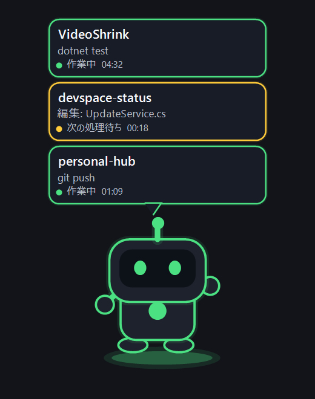
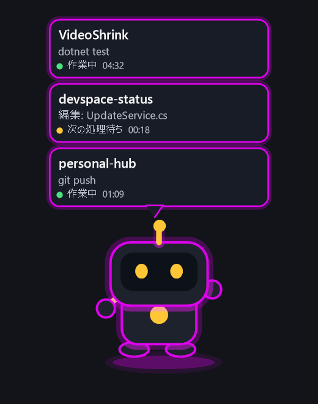
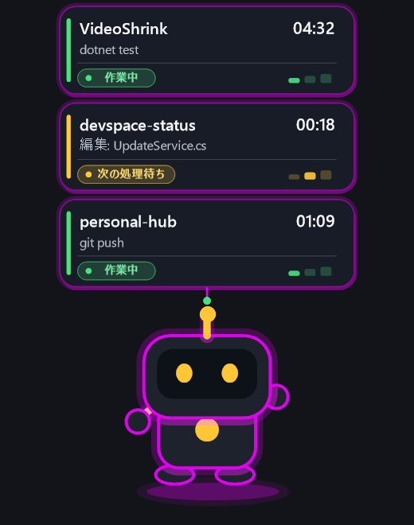
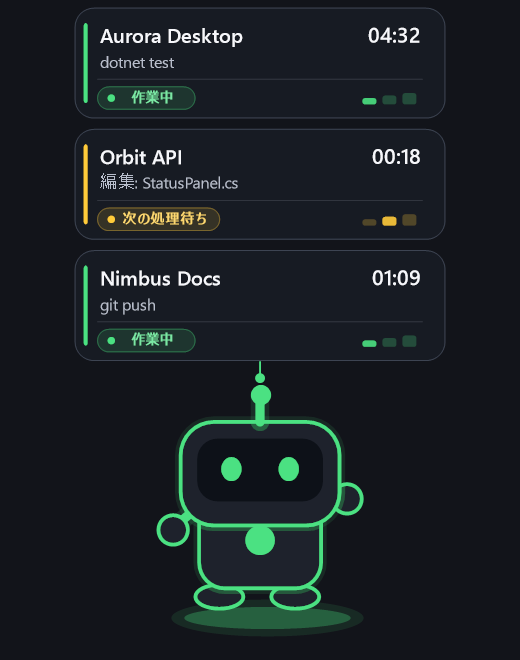
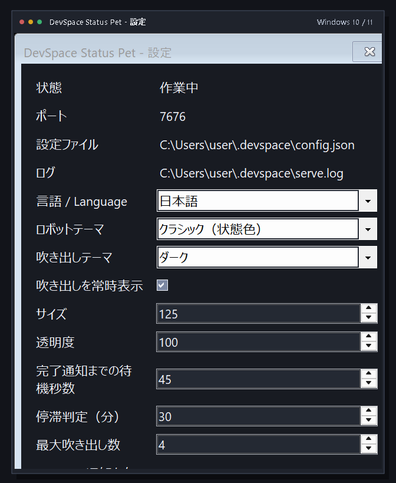
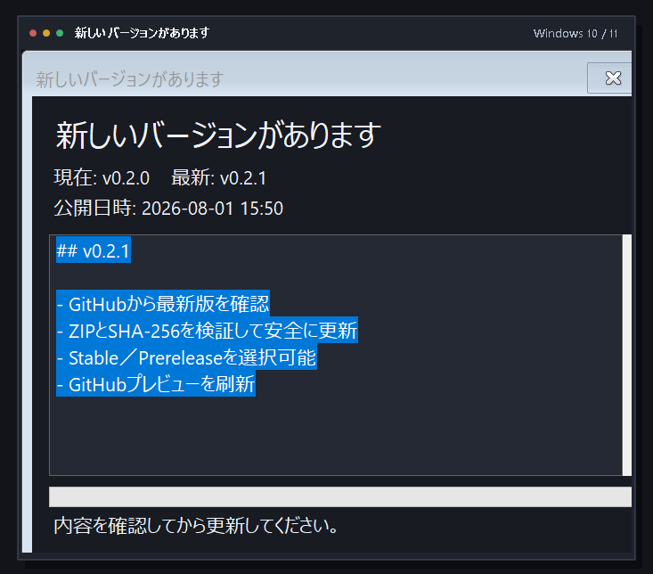
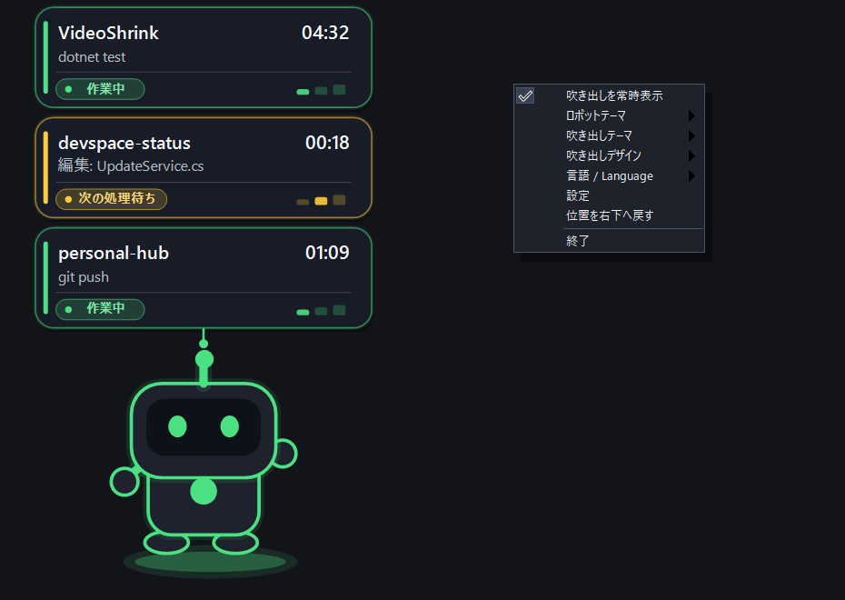

# DevSpace Status Pet

**[日本語](README.md) | [English](README.en.md)**

A Windows monitor that shows DevSpace activity through a system-tray icon and an animated desktop pet.

> **Stable release: v0.1.2 (C# / .NET 8 single executable)**<br>
> **Development build: v0.1.3-alpha.3 (matching live and preview rendering)**<br>
> The legacy PowerShell v0.1.0 release remains available on GitHub Releases as a rollback option.

## Features

- Detects actual local DevSpace work quickly
- Shows project name, current operation, and elapsed time
- Displays separate speech bubbles for parallel chats and workspaces
- Automatically detects UTF-8, UTF-16, and UTF-32 DevSpace logs
- Restores project names from historical `open_workspace` entries
- Notifies on completed work sessions, failures, stalls, and DevSpace shutdown
- Removes completed `Waiting for next step` bubbles after the configured quiet period
- Classic and Neon robot themes
- Independent Light and Dark speech-bubble themes
- Immediate switching between Standard Speech Bubble, Neon Monitor Card, and Clean Monitor Card designs
- Per-pixel alpha transparency so the live window matches the GitHub previews
- Dark tray menu, pet menu, nested menus, and settings window
- Japanese, English, and automatic OS-language selection
- Immediate settings preview for size, opacity, timing, and bubble count
- Windows startup registration
- Manual GitHub Release updates with SHA-256 verification
- Stable or optional prerelease update channels
- Crash logging and runtime diagnostics

## Preview

| Standard Classic | Standard Neon |
|---|---|
|  |  |

| Monitor Card (Neon) | Monitor Card (Clean) |
|---|---|
|  |  |

| Dark settings window | Safe updater |
|---|---|
|  |  |



## Requirements

- Windows 10 or Windows 11, x64
- [`@waishnav/devspace`](https://www.npmjs.com/package/@waishnav/devspace)
- DevSpace and this application running on the same computer

No separate .NET Runtime installation or PowerShell execution-policy change is required. macOS and Linux are not supported.

## Install

1. Download `DevSpace-Status-Pet-v0.1.2-win-x64.zip` from [GitHub Releases](https://github.com/n5-5n/devspace-status-pet/releases/latest)
2. Extract the ZIP
3. Run `DevSpaceStatusPet.exe`
4. Select **Install / update** from the context menu

Command-line installation is also available:

```text
DevSpaceStatusPet.exe --install
```

Install location:

```text
%LOCALAPPDATA%\DevSpaceStatusPetV2\DevSpaceStatusPet.exe
```

Existing PowerShell and .NET settings are reused automatically. Prerelease builds use the same settings files.

## Portable use

You can run the extracted `DevSpaceStatusPet.exe` directly without installing it.

Open the settings window immediately:

```text
DevSpaceStatusPet.exe --settings
```

## Status colors

| Color | Meaning |
|---|---|
| Green | A local process is running |
| Blue | DevSpace is running and idle |
| Yellow | The previous operation ended and the workspace is waiting for another step |
| Orange | The previous operation failed |
| Purple | Possible stall because CPU and log activity have stopped |
| Red | DevSpace is stopped |

Yellow does not immediately mean the full work session is complete. By default, after 45 seconds without another DevSpace operation, the app sends one completion notification and removes the waiting bubble.

## Parallel workspaces

Activities are separated by workspace ID, so two chats working in the same project still receive separate bubbles.

```text
VideoShrink
Running tests
Working  03:21

VideoShrink
Editing file
Waiting for next step  00:08
```

The maximum number of visible bubbles can be changed from 1 to 8 in Settings.

## Settings

Right-click the pet or tray icon and open **Settings**. Changes are applied immediately without pressing Save.

- Display language: Auto, Japanese, or English
- Robot theme: Classic or Neon
- Bubble theme: Light or Dark
- Bubble design: Standard Speech Bubble, Monitor Card (Neon), or Monitor Card (Clean)
- Pet size and opacity
- Bubble visibility and maximum count
- Completion quiet period
- Stall threshold
- Notifications
- Windows startup
- Check for updates at startup
- Whether prerelease builds are included

Settings files:

```text
%USERPROFILE%\.devspace\devspace-pet-settings.json
%USERPROFILE%\.devspace\devspace-pet-position.json
```

## Updates

Choose **Check for updates** from the tray menu or Settings to query the latest GitHub Release.

Before replacing the installed executable, the updater:

1. Downloads the ZIP and matching `.sha256` asset
2. Verifies the SHA-256 checksum
3. Rejects unsafe ZIP paths and extracts the package
4. Confirms that the executable version matches the Release
5. Backs up and replaces the installed executable
6. Restores the previous executable if replacement or launch fails

Only stable releases are checked by default. Prereleases can be enabled in Settings. Updates are never installed silently: the release notes are shown first, and replacement starts only after **Update now** is pressed.

Crash log:

```text
%LOCALAPPDATA%\DevSpaceStatusPet\logs\crash.log
```

## Uninstall

Keep settings:

```text
DevSpaceStatusPet.exe --uninstall
```

Remove settings too:

```text
DevSpaceStatusPet.exe --uninstall --remove-settings
```

The uninstaller does not modify DevSpace itself or any DevSpace project.

## Development and validation

```powershell
dotnet build .\src\DevSpaceStatusPet\DevSpaceStatusPet.csproj -c Release -warnaserror
dotnet run --project .\tests\DevSpaceStatusPet.Smoke\DevSpaceStatusPet.Smoke.csproj -c Release
.\scripts\Build-DotNetRelease.ps1
.\src\DevSpaceStatusPet\bin\Release\net8.0-windows10.0.17763.0\win-x64\DevSpaceStatusPet.exe --capture-previews docs
```

Pushing a `v0.x.x` tag runs Windows builds, smoke tests, and isolated self-install/self-uninstall validation before publishing the ZIP and SHA-256 checksum to GitHub Releases. Versions with a suffix are published as prereleases; plain versions are published as stable releases.

## Versioning policy

Each independent update increments the patch number by one, for example `v0.1.1 → v0.1.2 → v0.1.3`.

While the same update is being tested, the base version stays unchanged and only the prerelease suffix advances, for example `alpha.1 → alpha.2 → alpha.3`. The stable release removes the alpha suffix from that same base version.

Historical releases were normalized retroactively: `v0.2.0 series → v0.1.1 series`, `v0.2.1 → v0.1.2`, and `v0.3.0-alpha series → v0.1.3-alpha series`. See [`VERSIONING.md`](VERSIONING.md) for the complete mapping and policy.

## Legacy PowerShell release

The PowerShell v0.1.0 release remains available on GitHub Releases. The current .NET release reads its existing theme, language, bubble, and position settings automatically.

## License

[MIT License](LICENSE)
