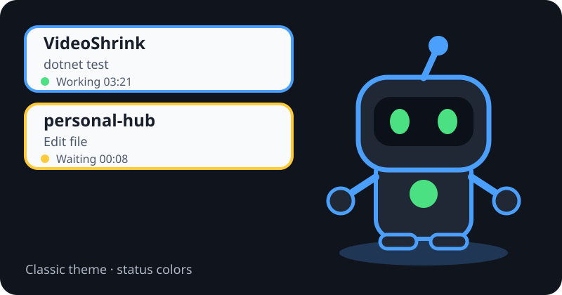
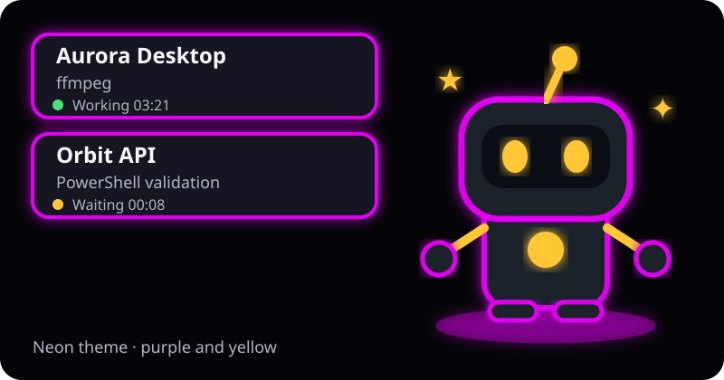

# DevSpace Status Pet

**[日本語](README.md) | [English](README.en.md)**

A Windows tray monitor and animated desktop pet for local DevSpace activity.

> **Stable release: v0.1.0 (PowerShell)**<br>
> See the [v0.2 English README](README.v0.2.en.md) for the C# / .NET 8 single-executable alpha.

- Detects real local processing quickly
- Shows project, operation, and elapsed time
- Displays multiple bubbles for parallel chats, workspaces, and processes
- Notifies on work-segment completion, failure, stalls, and DevSpace shutdown
- Classic and Neon themes
- Japanese, English, and automatic OS-language selection
- Stays on the desktop without adding a taskbar button

## Preview

| Classic | Neon |
|---|---|
|  |  |

## Requirements

- Windows 10 or Windows 11
- Windows PowerShell 5.1
- [`@waishnav/devspace`](https://www.npmjs.com/package/@waishnav/devspace)
- DevSpace and this monitor running on the same computer

macOS and Linux are not supported.

## Quick install

1. Download `DevSpace-Status-Pet-vX.Y.Z.zip` from [GitHub Releases](https://github.com/n5-5n/devspace-status-pet/releases/latest).
2. Extract the ZIP.
3. Run `Install.cmd`.

The installer copies the application to:

```text
%LOCALAPPDATA%\DevSpaceStatusPet
```

It creates:

- `DevSpace Status Pet` on the desktop
- `DevSpace Status Pet Settings` on the desktop
- A Windows startup shortcut

Installation still completes when DevSpace is not detected, and the installer explains what must be installed or started.

## Settings window

Right-click the pet or tray icon and choose **Open settings**. You can also use the `DevSpace Status Pet Settings` desktop shortcut.

The window shows and configures:

- Whether DevSpace is running
- Detected port
- `config.json` location
- `serve.log` location
- Display language: Auto, Japanese, or English
- Pet theme: Classic or Neon
- Always-visible bubbles
- Start with Windows
- Installed version

Saving safely restarts the monitor and pet.

## Tray states

| Color | State |
|---|---|
| Green | Running a local process |
| Blue | DevSpace is running and idle |
| Yellow | The previous process ended and is waiting for the next step |
| Orange | The previous process failed |
| Purple | CPU and log activity appear stalled |
| Red | DevSpace is stopped |

Yellow does not mean the entire assistant task is finished. By default, a completion notification appears once only after 45 seconds without a new DevSpace operation. It does not notify after every `read`, `edit`, or `bash` call.

## Parallel work

When several workspaces or process trees are active, the pet shows up to four bubbles.

```text
VideoShrink
dotnet test
Working  03:21

personal-hub
Edit file
Waiting for next step  00:08
```

Five or more activities are summarized as a remaining count.

## Pet controls

- Left-drag: move the pet
- Left-click: toggle always-visible bubbles
- Right-click: settings, language, theme, reset position, or exit

User settings are stored in:

```text
%USERPROFILE%\.devspace\devspace-pet-settings.json
%USERPROFILE%\.devspace\devspace-pet-position.json
```

## Uninstall

Run `Uninstall.cmd` from the installation directory or the extracted release folder.

You can choose whether to remove the saved theme, language, and pet position. The uninstaller does not modify DevSpace itself or any DevSpace project.

## Automatic detection and portability

The monitor automatically reads the current computer's:

- `%USERPROFILE%\.devspace\config.json`
- DevSpace port
- `allowedRoots`
- Opened workspace paths
- `serve.log`

Self-tests cover alternate drives, spaces in paths, non-English paths, and UNC paths. If a custom log location cannot be detected, pass it explicitly with `DevSpaceStatus.ps1 -LogPath ...`.

## Privacy and safety

The pet state JSON contains only safe summaries:

- State
- Project name
- Short operation such as `dotnet test`
- Elapsed time
- Success or failure

Full command lines, environment variables, credentials, and tokens are not written to the pet state file.

## Run from source

```powershell
.\tests\ParseScripts.ps1
.\Start-DevSpaceStatus.cmd
```

Build a release package with:

```powershell
.\scripts\Build-Release.ps1
```

Outputs:

```text
artifacts\DevSpace-Status-Pet-vX.Y.Z.zip
artifacts\DevSpace-Status-Pet-vX.Y.Z.zip.sha256
```

Pushing a `vX.Y.Z` tag makes GitHub Actions validate the project, build the ZIP, and publish a GitHub Release automatically.

## Changelog

[CHANGELOG.md](CHANGELOG.md)

## License

MIT License
